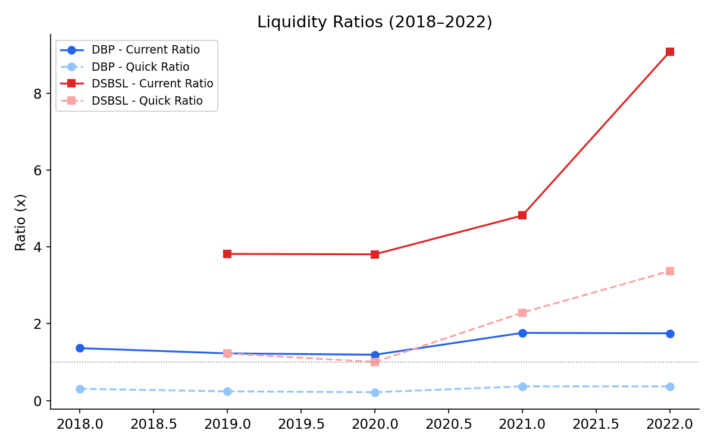
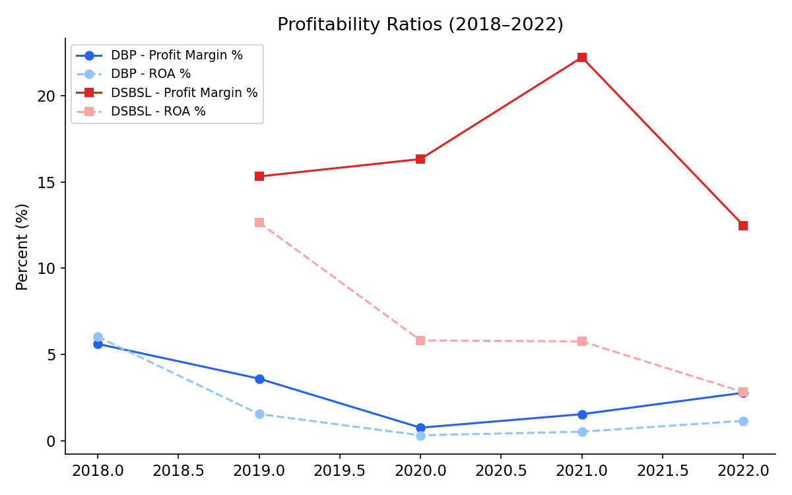
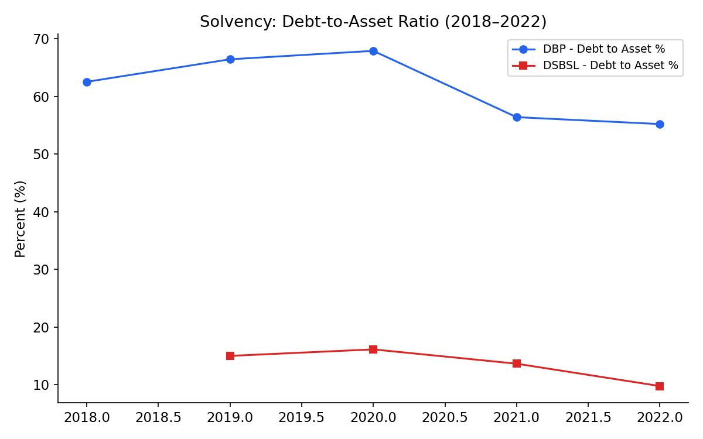

# Financial Statement Analysis: Deshbandhu Polymer Ltd. & Dominage Steel Building Systems Ltd.

**Tools used:** Excel (financial modeling, vertical/horizontal analysis, ratio analysis) ·

## 📌 Overview

A 5-year comparative financial statement analysis of two Bangladeshi manufacturing companies — **Deshbandhu Polymer Limited (DBP)** and **Dominage Steel Building Systems Limited (DSBSL)** — covering FY2018/19–2022. The goal was to build a full financial model from raw Balance Sheet and Income Statement data, then use vertical, horizontal, and ratio analysis to assess liquidity, profitability, and solvency, and form a view on which company represents the stronger investment case.

## 🧰 What's in this project

| Component | Description |
|---|---|
| Balance Sheet & Income Statement | 5-year raw financials rebuilt in Excel for both companies |
| Vertical Analysis | Each line item expressed as % of total assets / revenue |
| Horizontal Analysis | Year-over-year growth trends across all line items |
| Ratio Analysis | Liquidity, profitability, and solvency ratios calculated from scratch |
| Power BI Dashboard | Interactive visualization of the ratio trends |

📂 [DBP Financial Model (.xlsx)](./data/DBP_financial_model.xlsx) · [DSBSL Financial Model (.xlsx)](./data/DSBSL_financial_model.xlsx)

## 📊 Key Findings

### Liquidity

- **DSBSL's liquidity strengthened sharply**, with the current ratio rising from 3.8x (2019) to **9.1x (2022)** — the company is holding significantly more current assets than liabilities, though a ratio this high can also signal idle cash or excess inventory not being redeployed efficiently.
- **DBP's liquidity is comparatively tight**, current ratio ranging 1.2x–1.8x, and its quick ratio sitting well below 1x throughout (0.22x–0.37x) — meaning DBP depends heavily on inventory (not just cash/receivables) to cover short-term obligations.

### Profitability

- **DSBSL is the clear profitability leader**: profit margins of 12–22% vs. DBP's 0.8–5.6% across the same period. DSBSL's Return on Assets also outpaces DBP in every year shown.
- **DBP's profitability is thin and volatile** — margin dropped to a low of 0.75% in 2020 before partially recovering to 2.8% by 2022, suggesting sensitivity to cost pressures or pricing power issues.

### Solvency

- **DBP is far more leveraged**, with Debt-to-Asset consistently at 55–68% — more than half of assets are debt-financed, raising financial risk.
- **DSBSL is conservatively financed**, Debt-to-Asset falling to just **9.8% by 2022**, indicating low reliance on debt and stronger balance sheet resilience.

## 🧾 Takeaway

Based on the ratio analysis, **DSBSL shows the stronger overall financial position** — higher margins, better liquidity, and much lower leverage — while **DBP carries more financial risk**, with thin margins and high debt reliance, despite improving liquidity in the most recent two years. This kind of comparative analysis is the type of due-diligence work used in credit assessment, equity research, and internal financial planning.

## 🛠️ Methodology

1. Sourced 5 years of audited financial statements (Balance Sheet & Income Statement) for both companies.
2. Rebuilt statements in Excel and standardized line items for comparability.
3. Built vertical analysis (common-size statements) to assess capital/cost structure.
4. Built horizontal analysis to track YoY growth and identify anomalies.
5. Calculated liquidity, profitability, and solvency ratios for each year.

---
📫 *Feel free to connect with me on [www.linkedin.com/in/wadud-rahman](#) — open to Financial Analyst / Data Analyst roles.*
